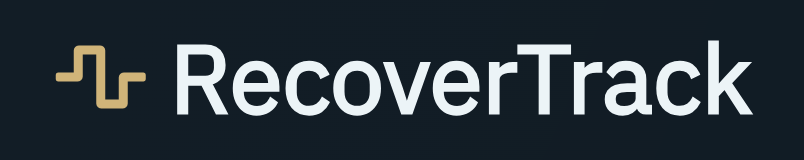

  

Track your recovery, training, sleep, and stress — all in one place.  
Built for lifters, athletes, and everyday grinders who want to train smart and recover smarter.

[🌐 Live Demo](https://recoverytrack.vercel.app)

---

## ✨ Features

### 🏠 Dashboard
  
Modern overview with recovery scores, check-in cards, and insights at a glance.  
Cards adapt to time of day and user onboarding.

---

### 🛏️ Daily Check-ins

- Morning: sleep hours, sleep quality, soreness, stress, HRV
- Evening: training summary, RIR, macros, calories
- One-tap modals with live saving
- Validated fields with sliders, pickers, and text inputs

---

### 🧠 Recovery Prediction

- ML-based recovery score (0–100)
- Combines user profile + recent logs
- Trained MLP model using PyTorch
- Personalized scores using per-user bias

---

### 📆 Calendar View

- View recovery scores across the week/month
- Click any date to edit logs
- Color-coded based on recovery level
- Integrated with history + bulk imports

---

### 📈 Trends + Insights

- Weekly and monthly views
- Auto-generated insights from rule templates:
  - Poor sleep patterns
  - Easy training blocks (high RIR)
  - Low calorie compliance
- Graphs for sleep, recovery, HRV, macros, and training volume

---

### 🧾 Bulk Import

- Upload `.csv` or `.xlsx` logs
- Must follow the provided template — users fill in the official format first, then upload it
- Parses each row into daily logs
- Runs recovery predictions per entry
- Feedback shown after upload

---

### 👤 Profile

- Edit profile anytime
- Upload avatar (via Supabase)
- Supports kg/lb, macros, and bio

---

## 💻 Tech Stack

| Frontend                    | Backend                      | ML & Analytics                  | Infrastructure              |
|-----------------------------|-------------------------------|----------------------------------|-----------------------------|
| React + TypeScript          | FastAPI (Python)              | PyTorch (MLP for recovery score) | Dockerized API (FastAPI)    |
| TailwindCSS + Headless UI   | SQLAlchemy + PostgreSQL       | Scikit-learn (preprocessing pipeline) | Supabase (DB + Storage) |
| Zustand (state)             | JWT Auth (access + refresh)   | Per-user residual bias modeling  | Vercel (frontend hosting)   |
| React Query (data fetching) | Supabase ORM + user auth      | CSV import, rolling avg + temporal encoding | GitHub Actions (ML upload) |

---

## 🌱 Motivation
I used to train hard but had no way of tracking how well I was recovering.  
**RecoverTrack** was born out of frustration, simply because I required a system to:

- 📊 log sleep, soreness, training, and macros
- 🧠 estimate recovery using ML
- 🗓️ visualize patterns and trends
- 🏋️ optimize training blocks over time

It’s become my daily tool to avoid overtraining and underperforming.

---

## 🛠 Wishlist / Future Features
- 🧠 Smarter models with HRV + wearable sync
- 🏷️ Tag-based filtering for trends (e.g., “cutting”, “deload”)
- 👥 Social accountability (friends view logs, comment)
- 🏗️ Custom Split Templates — users can create their own splits and sessions
- 📅 AI-generated monthly training plan based on user's recent recovery context
